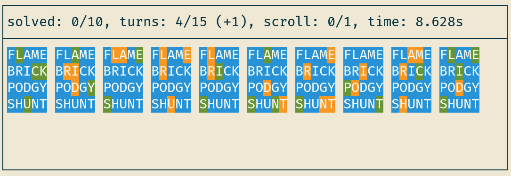
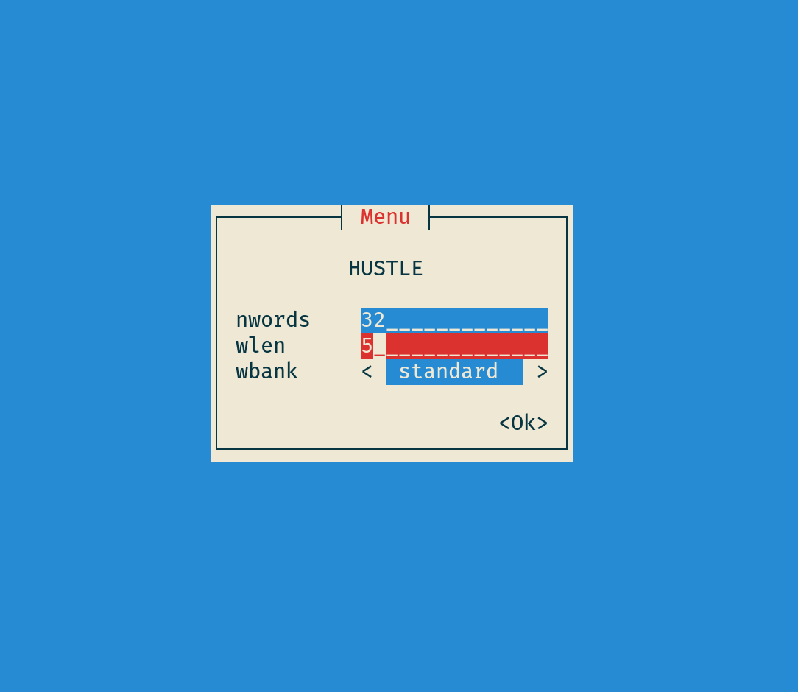
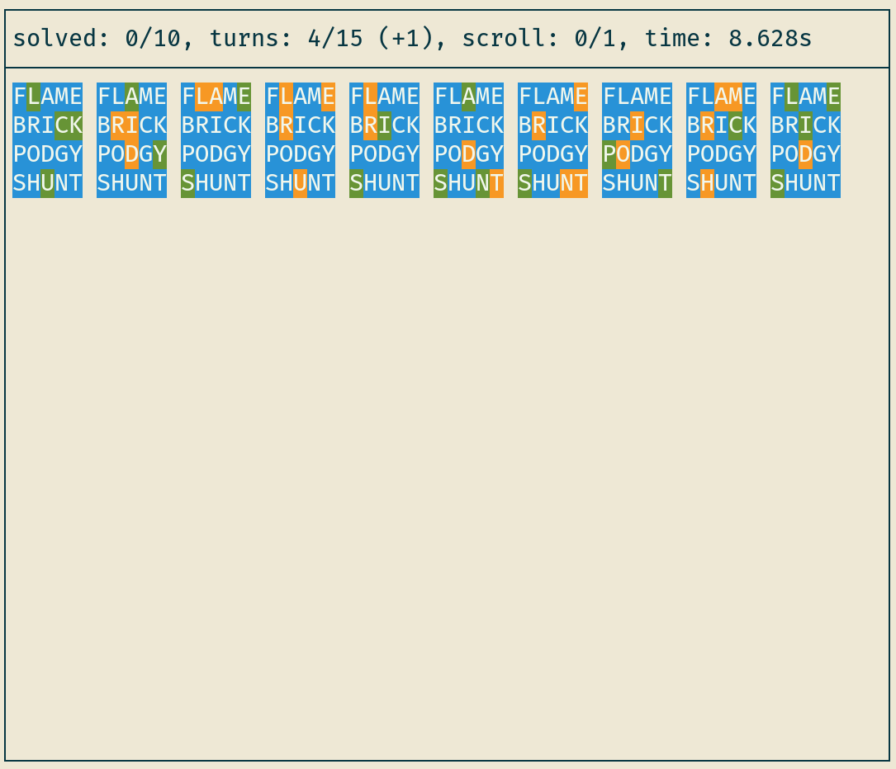
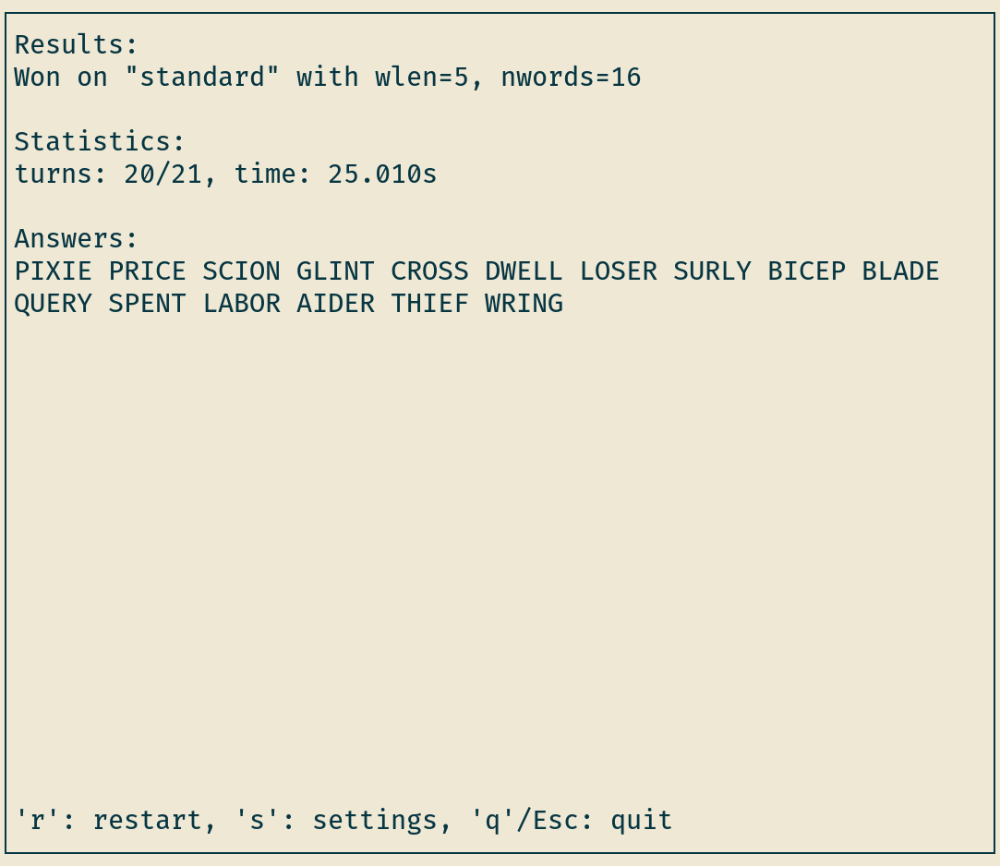

# Hustle


## Overview
Hustle is a terminal-based wordle clone and wordle solver written in
rust, geared towards speedrunning. The solver is inspired by Alex
Selby's article [The best strategies for Wordle](http://sonorouschocolate.com/notes/index.php/The_best_strategies_for_Wordle)
and [code](https://github.com/alex1770/wordle), and the game is
inspired by the many wordle spin-offs like
[octordle](https://octordle.com),
[hellowordl](https://hellowordl.net), and
[speedle](https://tck.mn/speedle/).

## Preview
<details><summary>Menu</summary>



</details>
<details><summary>Game</summary>



</details>
<details><summary>Results</summary>



</details>

## Installation
Hustle has three feature flags:
* `play`: makes the command `hustle play` in which you can play wordle.
* `solve`: makes the command `hustle solve`, which solves game states.
* `gen`: requires `solve` and makes the following commands:
  * `hustle hgen`: generate heuristic data
  * `hustle ggen`: generate general analysis data
  * `hustle lgen`: generate lower bounds data

You can specify which features you want by joining them with commas
(e.g. FEATURES="play,solve").

On Linux, you can install hustle with specific features by cloning and building it:
```
$ git clone https://github.com/lennonokun/hustle.git
$ cd hustle
$ make install FEATURES=<FEATURES>
```
On Arch Linux, you can install hustle only with all features using the PKGBUILD in extra:
```
$ makepkg --clean PKGBUILD
# tarball may be named something else
$ sudo pacman -U hustle-1.3.1-1-x86_64.pkg.tar.zst
```

## Usage
Refer to manpages with `man hustle`, and `man hustle <SUBCOMMAND>`.

## Configuration
Hustle can be configured with a TOML file at the following locations (with decreasing priority):

1. `$XDG_CONFIG_HOME/hustle/config.toml`
2. `$HOME/hustle/config.toml`

For the configuration options, see defaults at `/usr/share/hustle/config.toml`.

## TODO
### General
* better error handling
* use Path instead of AsPath
* get rid of WBank?
* more benchmarks + tests
* explain scripts + dependencies in README
* look at each files TODOs
* create github releases?
* make more easily installable
  - try to publish to AUR?
  - create packages for more distros
* integrate solver with tui?
* make decision tree viewer in tui
### Solver
* fix patch for ntops with hard
* add cache settings to main?
* record cache stats
* standardize types for stuff like NLETS and wlen
* check if solve strings are impossible? (allow impossible with --dirty)
* improve dtree pprint format
* make cache work for hard mode
* isolate fbmaps + methods (simplify wlen <= 5 optimizations)
* optimization:
  - is making dtree slow?
  - don't need to sort entire vec for selection
* see how decision tree would process specific answer(s)?
### Generation
* default to out's settings
* settings profiles?
* also check wbanks and hdata?
* range has option for single
### Game
* why do my ctrl-backspaces get sent as ctrl-h's?
* why doesn't backtab work?
* dictionary capabilities
* keep statistics and track pb's
* adjust layout for overflow
* re-add unknowns
* display pace
* multiple in a row?
  - exordle
  - infinite
* optionally show known letters beneath columns (or above?)
* single word
  - different layout for single
  - different modes like hard mode
* sync with wordle, duordle, quordle, octordle's, etc daily
* config
  - better error handling
  - unknowns
  - find out how to remove serde_json dependency from config (features)
