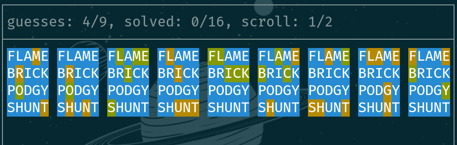

# Hustle


## Overview
Hustle is a terminal-based wordle clone and wordle solver written in
rust, geared towards speedrunning. The solver is inspired by Alex
Selby's article [The best strategies for
Wordle](http://sonorouschocolate.com/notes/index.php/The_best_strategies_for_Wordle)
and [code](https://github.com/alex1770/wordle), and the game is
inspired by the many wordle spin-offs like
[octordle](https://octordle.com),
[hellowordl](https://hellowordl.net), and
[speedle](https://tck.mn/speedle/).

## Installation
Hustle can be easily installed with cargo on linux:
```
$ cargo install hustle
```
Then — if you haven't already — add ~/.cargo/bin to your PATH in your
shell profile.

## Usage
Here are some examples of how to use hustle:
```
# play wordle
$ hustle play

# solve a wordle game
$ hustle solve salet.bbbbb.courd
$ hustle solve reast.bbbgg

# solve and output decision tree to file
$ hustle solve trace.gybbb --dt out

# solve with specific ntops and cutoff
$ hustle solve lodge.bbbbb --ntops 8 --cutoff 10

# solve using specific heuristic data
$ hustle solve salet.bbbgg --hdp-in myhdata.csv

# solve 6 letter words with hellowordl word bank
$ hustle solve salet.bbbgg --wbp data/bank2.csv

# run expensive heuristic data generation with top 10 words
$ hustle gen 10

# run expensive heuristic data generation and specify output
$ hustle gen 10 --hdp-out1 data1.csv --hdp-out2 data2.csv
```

## TODO
* make solving constants a cmd option
* make heuristics work for any word bank
* combine word banks into one file
* generally refactor, don't ignore warnings
* combine answer + guess word bank files? (and maybe struct)
* optimize solving
* create benchmarks and unit tests
* dictionary capabilities
* keep statistics and track pb's
* show untested letters?
* show known letters
  - display list below each column?
  - is this cheating?
  - regardless, it should be an option
* single word
  - different layout for single
  - different modes like hard mode
- sync with wordle, duordle, quordle, octordle's, etc daily
* make more easily installable
  - PKGBUILD, try to publish to AUR?
  - config file (colors, replacement method, etc)
