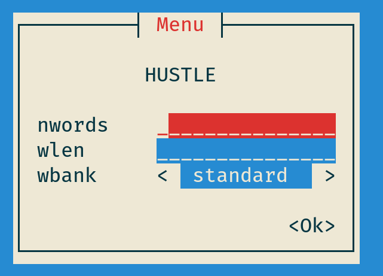
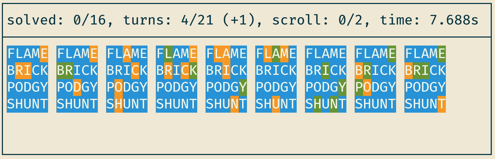
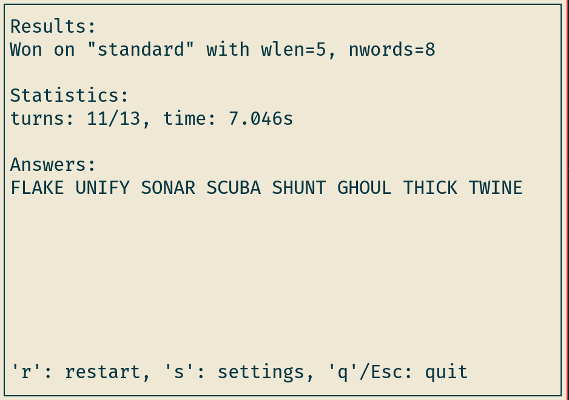

# Hustle

## Overview
Hustle is a terminal-based wordle clone and wordle solver written in
rust, geared towards speedrunning. The solver is inspired by Alex
Selby's article [The best strategies for Wordle](http://sonorouschocolate.com/notes/index.php/The_best_strategies_for_Wordle)
and [code](https://github.com/alex1770/wordle), and the game is
inspired by the many wordle spin-offs like
[octordle](https://octordle.com),
[hellowordl](https://hellowordl.net), and
[speedle](https://tck.mn/speedle/).

## Preview
### Menu

### Game

### Results


## Installation
On Linux, you can install hustle by cloning and building it:
```
$ git clone https://github.com/lennonokun/hustle.git
$ cd hustle
$ make install
```
On Arch Linux, you can install hustle using the PKGBUILD in extra:
```
$ makepkg --clean PKGBUILD
# tarball may be named something else
$ sudo pacman -U hustle-1.2.4-1-x86_64.pkg.tar.zst
```
## Usage
Here are some examples of how to use hustle:
```
# play hustle
$ hustle play

# solve a wordle game
$ hustle solve salet.bbbbb.courd

# solve all of wordle and output to file (takes me 1m34s)
$ hustle solve --dt out

# solve and list potential answers
$ hustle solve crate.bybyb --alist

# solve and list results of top words
$ hustle solve crate.bybyb --elist

# solve with specific number of top words to try
$ hustle solve lodge.bbbbb --ntops 8

# solve using specific heuristic data
$ hustle solve salet.bbbgg --hdp hdata.csv

# solve 6 letter words with hellowordl word bank
$ hustle solve traces.bgbbyy --wbp /usr/share/hustle/bank2.csv --wlen 6

# generate heuristic data with n=100
$ hustle hgen 100 hdata.csv

# generate analysis data with n=100
$ hustle agen 100 adata.csv
```
Run hustle --help for more information.

## Configuration
Hustle's can be configured with a TOML file at the following location (with decreasing priority):
1. $XDG\_CONFIG\_HOME/hustle/config.toml
2. $HOME/hustle/config.toml
For the configuration options, see defaults at /usr/share/hustle/config.toml.

## TODO
### General
* better error handling
* use Path instead of AsPath
* get rid of WBank?
* generally refactor, don't ignore warnings
* create benchmarks and unit tests
* make man page with clap
* explain scripts + dependencies in README
* look at each files TODOs
### Solver
* add cache settings to main?
* record cache stats
* standardize types for stuff like NLETS and wlen
* make heuristics work for any word bank
* check if solve strings are impossible? (allow impossible with --dirty)
* improve dtree pprint format
* multiple heuristic options? (linear reg, precomputed, etc)
* optimize solving
  - better lower bounds
  - re-add multithreading
    (beta pruning is mostly single-threaded though)
  - look at flame graphs, etc
### Game
* why do my ctrl-backspaces get sent as ctrl-h's?
* why doesn't backtab work?
* dictionary capabilities
* keep statistics and track pb's
* adjust layout for overflow
* re-add unknowns
* multiple in a row?
* exordle
* infinite
* display pace
* optionally show known letters beneath columns (or above?)
* single word
  - different layout for single
  - different modes like hard mode
- sync with wordle, duordle, quordle, octordle's, etc daily
* config
  - how to handle enum fields?
  - better error handling
  - unknowns
  - set theme not just palette?
  - find out how to remove serde_json dependency from config (features)
* create github releases?
* make more easily installable
  - try to publish to AUR?
  - create packages for more distros
